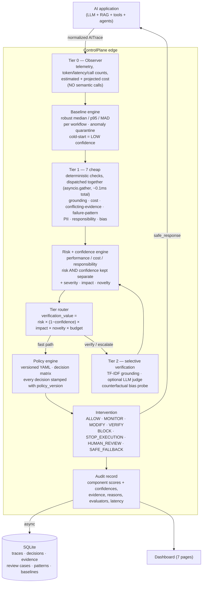
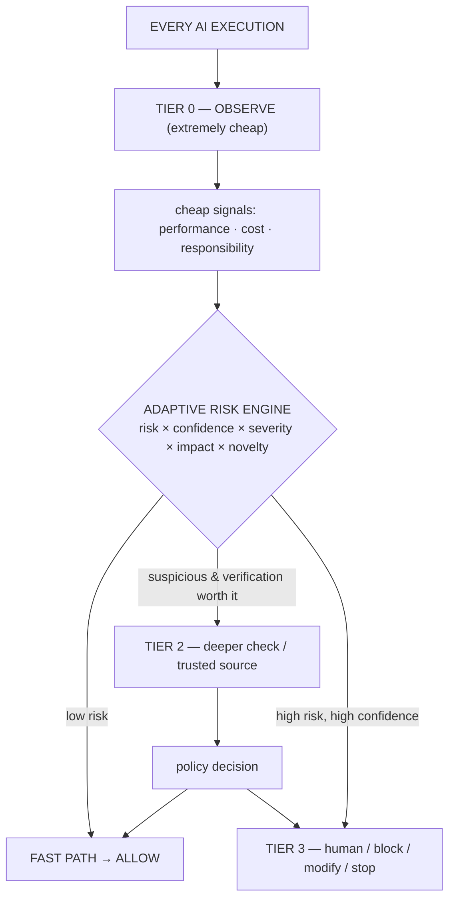
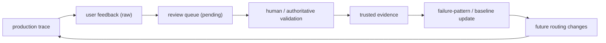

# ControlPlane.ai — Architecture

> Adaptive Runtime AI Oversight. Observe every AI execution cheaply, investigate
> selectively, act proportionally, learn continuously.

ControlPlane sits **between AI execution and downstream consumption**:

```
AI application → LLM / RAG / Agent → generated response
        → ControlPlane → allow / modify / block / escalate → user / system
        ↘ (async) telemetry + audit + analytics
```

For normal low-risk interactions, **Tier 0 + Tier 1 are the fast path**. For
high-risk cases, ControlPlane acts **synchronously, before the response reaches
the user**. Non-critical deep evaluation runs asynchronously after disclosure.

---

## 1. System architecture



### Ownership boundary

| The application / team owns | ControlPlane owns |
| --- | --- |
| authorization, IAM | standardized observation |
| business rules, allowed actions | cross-dimensional risk assessment |
| data access & classification | adaptive verification routing |
| domain policies | proportional intervention |
| human-approval requirements | auditability |
| | cross-application operational learning |

ControlPlane consumes **standardized policy metadata** (data classification,
sensitive entities, human-review rules). It does not learn every team's business
logic.

---

## 2. The adaptive funnel (four tiers)



The expensive path is the **exception**, not the default. On synthetic mixed
traffic the fast path carries **~93%** of interactions (see `docs/evaluation.md`).

---

## 3. Multi-step / agent traces

A trace is a tree of steps (`llm_call`, `retrieval`, `tool_call`,
`final_response`). Two mechanisms handle compounding risk:

```mermaid
sequenceDiagram
    participant U as User
    participant A as Agent
    participant CP as ControlPlane
    U->>A: turn 1 (retrieval returns conflicting SLA versions)
    A->>CP: trace (answer follows one version)
    CP-->>A: MONITOR — conflicting_evidence signal, LOW confidence, unresolved
    Note over CP: inherited_risk ≈ 0.5 written to next turn's metadata + terminal step
    U->>A: turn 2 "process that refund"
    A->>CP: trace (inherits ≈ 0.5; label inherited_risk)
    CP-->>A: MONITOR ("Inherited risk 0.50 carried from an earlier turn")
    A->>CP: turn 3 tool step, consequential_action = true, NO context of its own
    CP-->>A: HUMAN_REVIEW ("compounding risk from earlier steps ... consequential / irreversible action")
```

Verified `inherited_risk_trace` is non-decreasing (e.g. `[0.0, 0.5, 0.5]`; the exact turn-2 value is baseline-sensitive). General mechanism — no
scenario-name branching:

- **`ConflictingEvidenceEvaluator`** (Tier 1): contradictory values for the same
  concept across retrieved chunks (or an explicit `risk_signals` marker) →
  MEDIUM risk, **LOW confidence**. Conservative: needs ≥2 chunks, comparable
  units/magnitudes, a shared non-structural concept word; zero on ordinary
  non-conflicting multi-chunk retrieval.
- **`sessions.evaluate_session`** resolution semantics: `ALLOW/MONITOR/VERIFY`
  carry risk forward; **`SAFE_FALLBACK` softens but does not erase** it (a
  fallback ≠ resolution); `BLOCK/STOP/HUMAN_REVIEW/MODIFY` resolve it.
- **`risk_engine`** reads `inherited_risk` from both `trace.metadata` and the
  terminal step; `inherited ≥ 0.35` raises `performance.risk`, caps its
  confidence, and (with `consequential_action`) forces HIGH impact.
- **`decide()` rule 3b** hard-gates a consequential action carrying unresolved
  inherited risk to `HUMAN_REVIEW`.
- **In-flight cost hook** (`check_agent_step`): after each step →
  `update cumulative cost → project trajectory → CONTINUE | STOP`, stopping
  *before* projected cost breaches the workflow budget.

---

## 4. Learning loop



Trust tiers: `raw_feedback → machine_evidence → human_validated → authoritative`.
Raw feedback **cannot** promote a trusted failure pattern on its own; a pattern
needs human/authoritative validation, de-duplication and a minimum evidence
count. A confirmed false positive *cools a pattern down* (alert-fatigue control).

The payoff: once a failure pattern is **trusted**, a matching interaction is
acted on using that validated evidence **without paying for Tier 2 again** — so
the deep-check rate falls while recall holds. Benchmark *simulation*
(`_learning_effect` injects the trusted patterns): deep-check rate ~6.4% → ~3.9%,
recall held. The real DB feedback→validation→routing flow is tested end-to-end in
`tests/integration/test_learning_loop.py`.

---

## 5. Interoperability

- Internal `AITrace` schema maps field-for-field to **OpenTelemetry GenAI**
  semantic conventions (`gen_ai.system`, `gen_ai.request.model`,
  `gen_ai.usage.*`, `gen_ai.tool.*`, `gen_ai.workflow.name`). See
  `backend/app/adapters/otel.py` and the mapping table there. A collector is
  **not** required; a `ConsoleOTelExporter` stub shows the seam.
- Existing tools are **components, not competitors**: Presidio (PII), Ragas-style
  grounding, DeepEval-style LLM-judge, NeMo-Guardrails-style concurrent checks,
  Langfuse-style observation. ControlPlane's differentiator is the **adaptive
  runtime decision loop** that orchestrates them. `adapters/otel.py` and
  `sdk/client.py` are **illustrative seams**, not wired into the running system.
- Model/provider-neutral via `ModelAdapter` (`MockModelAdapter` default,
  `OpenAIAdapter` optional). No component imports a provider SDK directly.

### Concurrency, honestly

Tier-1 checks are deterministic CPU work; all 7 run in **~0.1 ms** measured, so
`asyncio.gather` is a scheduling convenience, **not** a parallel speed-up
(threading them was measured and is slower). Concurrency matters at Tier 2,
where an evaluator may do real I/O (an external LLM judge, a Presidio service).
The record stores `sequential_check_ms` (summed per-check time) and
`parallel_check_ms` (dispatch wall time) for transparency, not as a speed claim.

---

## 6. Repository map

```
backend/app/
  core/         schemas (AITrace, EvaluationResult, RiskSummary, DecisionRecord), models, db, config
  controlplane/ observer · baselines · risk_engine · policy_engine · router · interventions
                cost_model · signatures · sessions · learning · analytics · benchmark · evaluation
  evaluators/   base · grounding · cost · conflicting_evidence · pii · responsibility · bias · failure_patterns · llm_judge
  adapters/     providers (mock/openai) · otel (illustrative stub)
  sdk/          client (illustrative facade — not wired into the app)
  seed/         scenarios (A–G, C2) · data (synthetic traffic) · blind_cases (frozen challenge set) · runner
  api/          traces · feedback · review · policies · metrics · demo · benchmark
config/         policies/*.yaml (+ data_policy.pii_action) · workflows/*.yaml   (versioned)
frontend/       React + TS + Vite dashboard (7 pages)
scripts/        seed_demo · generate_traffic · run_evaluation (--suite) · benchmark (--deep-eval-sim-latency)
```
